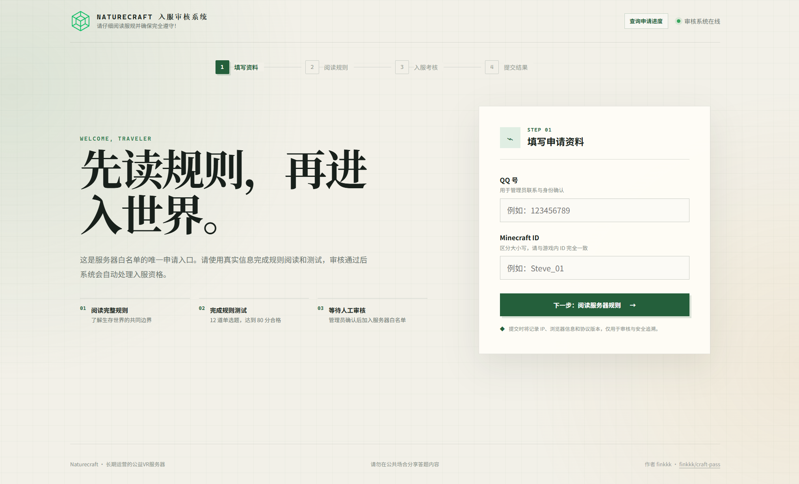
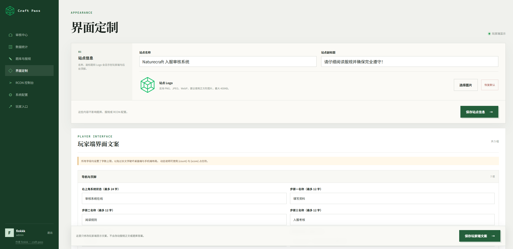

<div align="center">

# Craft Pass

**面向 Minecraft 社区的入服申请、答题审核与 RCON 白名单管理系统**

[](https://github.com/finkkk/craft-pass/actions/workflows/ci.yml)
[](https://github.com/finkkk/craft-pass/releases)
[](LICENSE)
[](.nvmrc)
[](compose.yaml)

[功能亮点](#功能亮点) · [界面预览](#界面预览) · [快速开始](#快速开始) · [使用流程](#使用流程) · [开发指南](#开发指南) · [项目文档](#项目文档)

</div>

Craft Pass 为 Minecraft 服务器提供完整的玩家准入流程：玩家阅读服规、填写身份信息并完成答题，管理员在后台审核后，可通过 RCON 自动将玩家加入白名单。

它适合希望摆脱表单、群聊和手动执行指令，用一套自托管系统统一管理入服申请的 Minecraft 社区。

## 界面预览

| 玩家申请端 | 管理后台 |
| --- | --- |
|  |  |

## 功能亮点

- **完整申请流程**：资料填写、服规阅读、协议签署、随机抽题、后端判分与进度查询
- **高效审核管理**：分类查看、批量审批、拒绝原因、记录修改与申请统计
- **RCON 自动化**：审核通过后自动添加白名单，支持失败重试、执行记录与危险命令拦截
- **灵活内容配置**：自定义站点名称、Logo、文案、服规、协议、题库、抽题数量与合格分数
- **身份与访问保护**：QQ/Minecraft ID 查重、IP 与身份频率限制、管理员会话和操作日志
- **开箱即用部署**：网页初始化向导、SQLite 自动迁移、敏感配置加密和 Docker 数据持久化

## 使用流程

```text
玩家提交资料并答题
        ↓
系统校验身份、判分并保存申请
        ↓
管理员在后台审核
        ↓
审核通过 ── RCON 自动加入 Minecraft 白名单
```

主要页面入口：

| 页面 | 地址 | 用途 |
| --- | --- | --- |
| 玩家端 | `/` | 阅读服规、填写资料、答题和查询进度 |
| 初始化向导 | `/setup` | 完成首次站点配置 |
| 管理后台 | `/admin` | 审核申请及管理系统 |
| 数据统计 | `/admin/statistics` | 查看申请趋势、状态分布和通过率 |
| 内容管理 | `/admin/content` | 编辑服规、协议、题库和合格分数 |
| 系统设置 | `/admin/settings` | 配置申请限制、端口和 RCON |

## 快速开始

### Docker Compose（推荐）

适用于 Linux 服务器和生产部署。宿主机无需安装 Node.js、npm 或 SQLite。

```bash
git clone https://github.com/finkkk/craft-pass.git
cd craft-pass
docker compose up -d --build
docker compose logs -f app
```

首次启动后：

1. 从应用日志中复制一次性部署令牌；
2. 打开 `http://localhost:47821/setup`；
3. 按向导创建管理员并配置站点与 RCON。

应用会自动生成加密密钥、初始化 SQLite 数据库并执行迁移。RCON 默认关闭，可在初始化向导或管理后台中启用。

Compose 会先运行一次性的 `data-init` 服务修正挂载目录所有权，再以非 root `node` 用户启动应用，无需手动执行 `chown`。看到 `data-init` 以状态 `Exited (0)` 结束属于正常现象。

> [!IMPORTANT]
> 默认端口只绑定到 `127.0.0.1:47821`。公网部署请配置 HTTPS 反向代理，完整步骤见 [Docker Compose 生产部署](docs/docker-deployment.md)。

已有 Nginx 时，将请求反向代理到 `http://127.0.0.1:47821`。没有反向代理时，可启用项目内置的 Caddy：

```bash
cp .env.example .env
# 在 .env 中设置 SITE_ADDRESS 和 CORS_ORIGINS
docker compose --profile caddy up -d --build
```

Docker 构建默认限制 Node.js 堆内存并降低原生依赖编译并发，更适合小内存服务器；依赖缓存也会加快后续构建。内存充足时可通过 `NODE_MAX_OLD_SPACE_SIZE` 构建参数提高上限，详见生产部署文档。

### Windows 本机体验

需要 Node.js `>=22.12.0`、npm `>=10` 和 Git。

```powershell
git clone https://github.com/finkkk/craft-pass.git
cd .\craft-pass
npm run setup
```

`npm run setup` 会安装前后端依赖、完成构建和数据库迁移，并启动服务。后续可使用 `npm start` 再次启动。

### 直接运行 Node.js

适合已经配置 Nginx/Caddy 和 systemd/PM2 的环境：

```bash
nvm install
nvm use
npm run ci:all
npm run deploy
NODE_ENV=production npm run start:server
```

生产环境请使用进程管理器保持服务运行。更多配置见 [部署与首次初始化](docs/deployment.md)。

## 部署配置

根目录的 `.env.example` 包含 Docker 部署的可选配置。零配置即可启动；使用公网域名、自定义宿主机端口或预设 RCON 参数时，再复制为 `.env`。

常用配置：

| 变量 | 说明 | 默认值 |
| --- | --- | --- |
| `APP_PORT` | 宿主机环回端口 | `47821` |
| `CORS_ORIGINS` | 允许访问的浏览器来源，多个值用逗号分隔 | 本机地址 |
| `SITE_ADDRESS` | 内置 Caddy 使用的域名或监听地址 | `:80` |
| `RCON_ENABLED` | 是否启用 RCON | `false` |
| `RCON_HOST` | Minecraft RCON 地址 | `host.docker.internal` |
| `RCON_PORT` | Minecraft RCON 端口 | `25575` |
| `RCON_PASSWORD` | Minecraft RCON 密码，启用时至少 3 位 | 空 |

> [!CAUTION]
> 不要提交 `.env`、RCON 密码或数据目录。不要把 RCON 端口直接暴露到公网。

Minecraft Java 服务端通常需要在 `server.properties` 中启用：

```properties
white-list=true
enable-rcon=true
rcon.port=25575
rcon.password=请使用高强度密码
```

默认白名单命令为 `whitelist add {minecraftId}`，其中 `{minecraftId}` 是必需占位符。

## 数据与备份

| 运行方式 | 持久化目录 |
| --- | --- |
| Docker Compose | `./data/` |
| 直接运行 Node.js | `./backend/data/` |

数据目录包含 SQLite 数据库、题库、站点配置、Logo 和用于解密敏感配置的密钥。请整体备份，不要只复制数据库文件。

Docker 备份示例：

```bash
docker compose stop app
tar -czf craft-pass-data-$(date +%F).tar.gz data
docker compose start app
```

## 技术架构

```text
浏览器
  │
  ▼
Nginx / Caddy（HTTPS）
  │
  ▼
Craft Pass :47821
  ├── React + Vite
  ├── Express + Prisma
  ├── SQLite ───────────► data/
  └── RCON ─────────────► Minecraft Server
```

| 模块 | 技术 |
| --- | --- |
| 前端 | React 19、TypeScript、Vite |
| 后端 | Node.js、Express 5、Zod |
| 数据 | Prisma、SQLite |
| 部署 | Docker Compose、Caddy（可选） |

## 开发指南

安装所有依赖：

```bash
npm run install:all
```

分别启动前后端开发服务：

```bash
npm run dev:backend
npm run dev:frontend
```

提交代码前建议运行：

```bash
npm run check:platform
npm run typecheck
npm test
npm run build
```

## 项目结构

```text
craft-pass/
├── frontend/          React + Vite 前端
├── backend/           Express + Prisma 后端
│   ├── prisma/        数据模型与迁移
│   └── data/          Node.js 直跑模式数据
├── data/              Docker 持久化数据
├── docs/              部署、接口与运维文档
├── scripts/           安装、启动和检查脚本
├── compose.yaml
├── Dockerfile
└── .env.example
```

## 项目文档

- [文档导航](docs/README.md)
- [Docker Compose 生产部署](docs/docker-deployment.md)
- [部署与首次初始化](docs/deployment.md)
- [日常运维与故障排查](docs/operations.md)
- [API 说明](docs/api.md)
- [数据库与迁移](docs/database.md)
- [发布状态](docs/release-status.md)

## 参与贡献

欢迎提交 Issue 和 Pull Request。请在提交前完成项目的类型检查、测试与构建。

## License

本项目基于 [MIT License](LICENSE) 开源。
